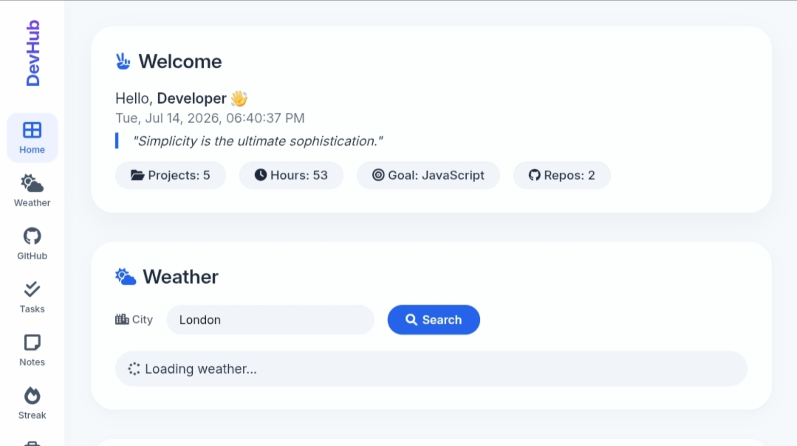
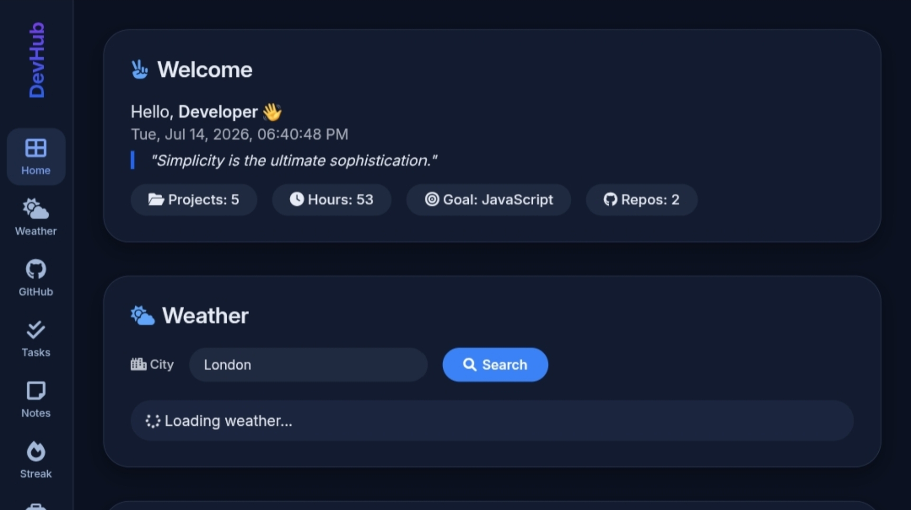
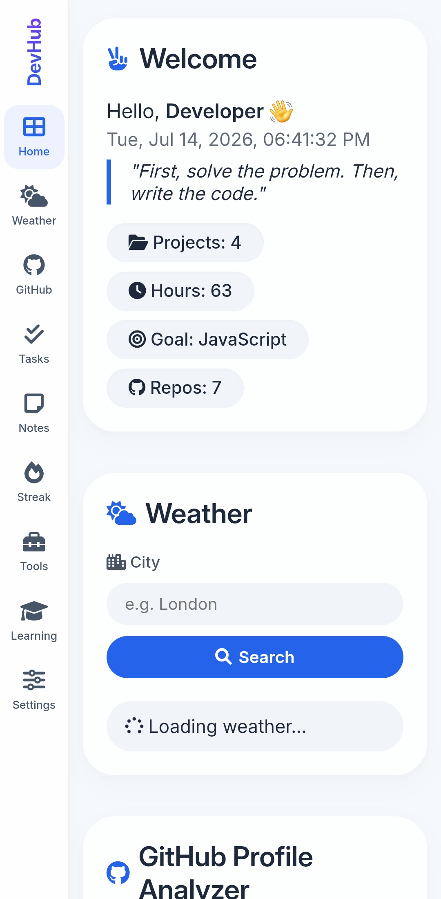
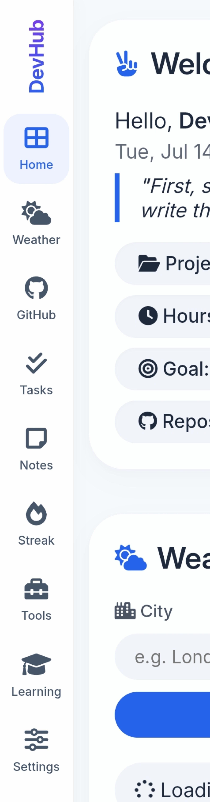

<div align="center">
  
# 🚀 DevHub Dashboard

### *Your All-in-One Developer Productivity Suite*

[](https://github.com/AbdiVibe/DevHub-Dashboard/stargazers)
[](https://github.com/AbdiVibe/DevHub-Dashboard/network)
[](https://github.com/AbdiVibe/DevHub-Dashboard/issues)
[](LICENSE)
[](https://github.com/AbdiVibe)

[](https://developer.mozilla.org/en-US/docs/Web/JavaScript)
[](https://developer.mozilla.org/en-US/docs/Web/HTML)
[](https://developer.mozilla.org/en-US/docs/Web/CSS)
[](https://web.dev/progressive-web-apps/)
[](https://pages.github.com/)

</div>

---

## 🌐 **Live Demo**

<div align="center">
  
### [👉 Click Here to Try DevHub Dashboard 👈](https://AbdiVibe.github.io/DevHub-Dashboard)

</div>

---

## 📸 Screenshots

### 🌞 Light Mode

<p align="center">
  
</p>

### 🌙 Dark Mode

<p align="center">
  
</p>

### 📱 Mobile View

<p align="center">
  
</p>

### 🛠️ Developer Tools

<p align="center">
  
</p>

---

## ✨ **Features**

### 🛠️ **Developer Tools**

<table>
  <tr>
    <td align="center"><b>🔑 Password Generator</b></td>
    <td>Generate secure, random passwords instantly with customizable length</td>
  </tr>
  <tr>
    <td align="center"><b>📊 JSON Formatter</b></td>
    <td>Format and validate JSON data with proper indentation and syntax highlighting</td>
  </tr>
  <tr>
    <td align="center"><b>📝 Character Counter</b></td>
    <td>Count characters, words, and lines in real-time as you type</td>
  </tr>
  <tr>
    <td align="center"><b>✏️ Markdown Preview</b></td>
    <td>Write markdown and see the rendered preview instantly</td>
  </tr>
</table>

### 📊 **Core Features**

<table>
  <tr>
    <td align="center"><b>✅ Task Manager</b></td>
    <td>Add, complete, and organize tasks by category (Coding, Learning, Personal)</td>
  </tr>
  <tr>
    <td align="center"><b>📓 Notes System</b></td>
    <td>Create, search, and manage your notes with real-time filtering</td>
  </tr>
  <tr>
    <td align="center"><b>📈 Learning Progress</b></td>
    <td>Track your skill development with interactive progress bars</td>
  </tr>
  <tr>
    <td align="center"><b>🔥 Coding Streak</b></td>
    <td>Visual calendar to track your coding consistency and daily progress</td>
  </tr>
</table>

### 🌐 **Integrations**

<table>
  <tr>
    <td align="center"><b>🌤️ Weather Widget</b></td>
    <td>Current weather and 5-day forecast for any city (OpenWeatherMap API)</td>
  </tr>
  <tr>
    <td align="center"><b>🐙 GitHub Analyzer</b></td>
    <td>View profile stats, repos, stars, contributions, and achievements (GitHub API)</td>
  </tr>
  <tr>
    <td align="center"><b>🌓 Dark/Light Theme</b></td>
    <td>Toggle between themes for comfortable viewing day or night</td>
  </tr>
  <tr>
    <td align="center"><b>📱 PWA Ready</b></td>
    <td>Install as a Progressive Web App on any device (mobile, tablet, desktop)</td>
  </tr>
</table>

### 💾 **Data Persistence**

- ✅ All data saved locally in your browser using `localStorage`
- ✅ No account or sign-up required
- ✅ Works offline (PWA ready)
- ✅ Data persists across browser sessions
- ✅ Privacy-focused - your data never leaves your device

---

## 🚀 **Quick Start**

<details>
<summary><b>📋 Click to expand</b></summary>

### Option 1: 🌐 **Use Live Version**
```bash
# Simply visit in your browser:
https://AbdiVibe.github.io/DevHub-Dashboard